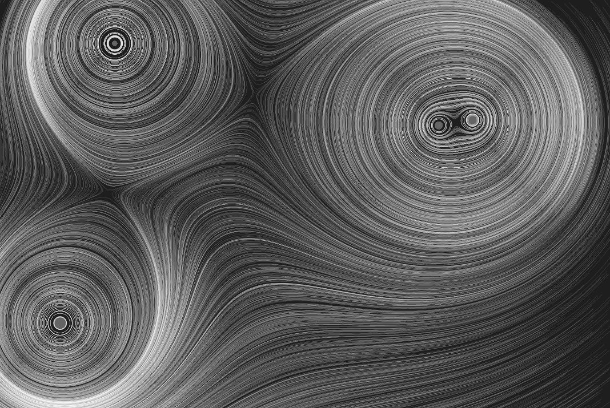

# Asteroid Gliders

This is my attempt at implementing something like the system mentioned in [this tweet](https://twitter.com/lorenschmidt/status/1031662379069853697).

Depends on SFML for rendering and drawing the window.

## Usage

Press r to regerate with a new seed, press q to quit.

## Building

```bash
mkdir build
cd build
cmake ..
cmake --build .
```


