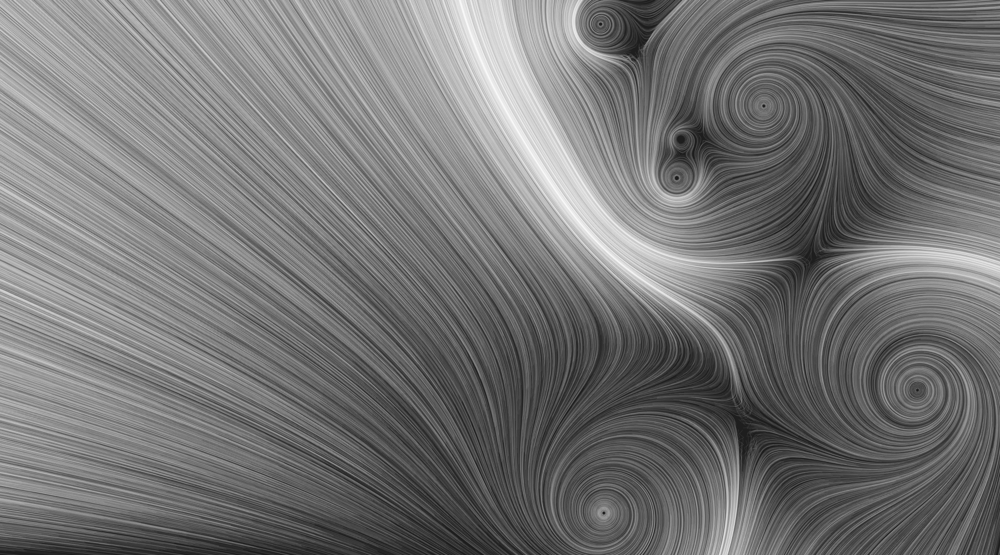
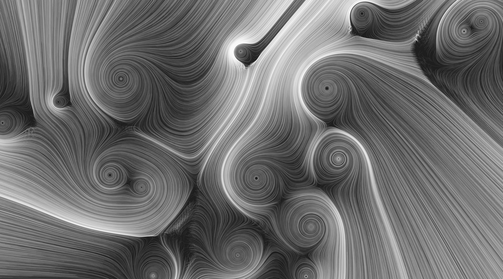
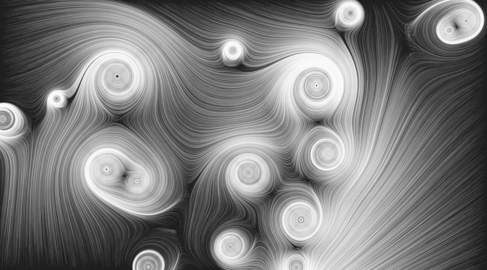
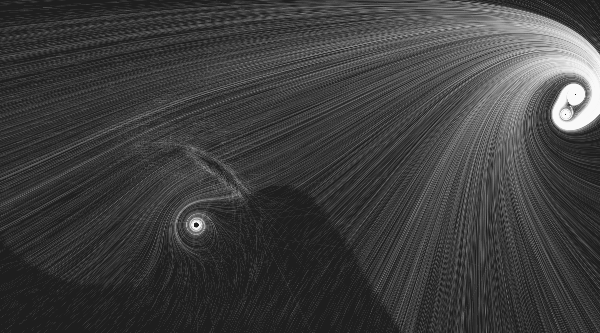
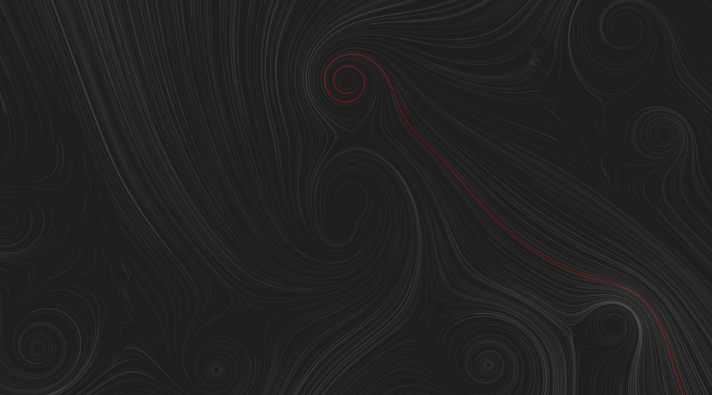
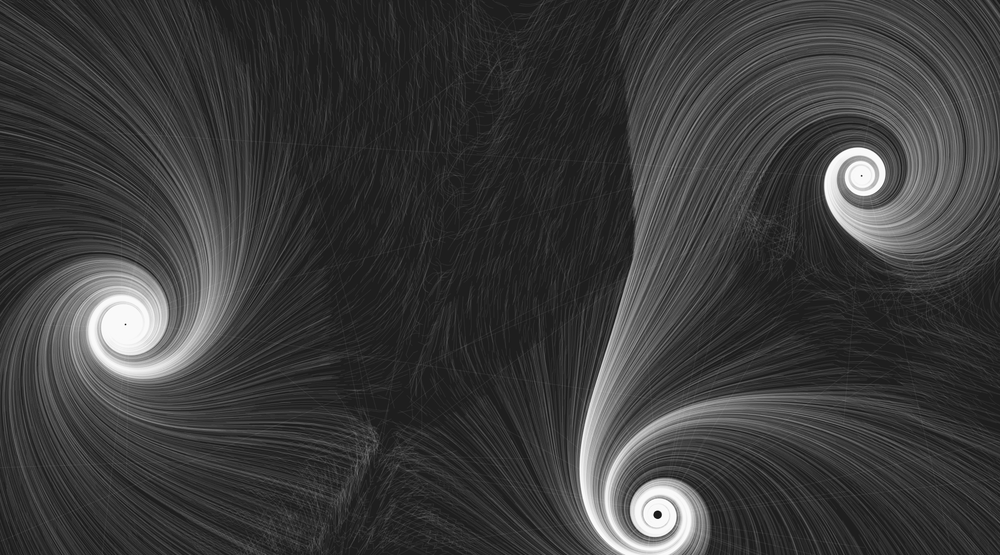
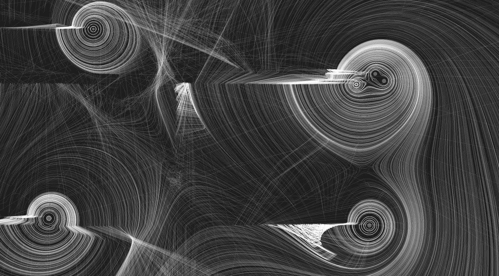

# Asteroid Gliders

This is my attempt at implementing something like the system mentioned in [this tweet](https://twitter.com/lorenschmidt/status/1031662379069853697).

## Dependencies

SFML for rendering and window.

Boost Filesystem for checking for existing files in the image output directory.

Eigen3 for some code that doesn't do anything yet, but will do soon.

## Usage

Try the following keys:
* <kbd>r</kbd> to regerate with next seed
* <kbd>shift</kbd><kbd>r</kbd> to regenerate with previous seed
* <kbd>t</kbd> to plot the trajectories (default)
* <kbd>g</kbd> to plot the gravitational field
* <kbd>s</kbd> to save image to disk
* <kbd>q</kbd> to quit

## Building

```bash
mkdir build
cd build
cmake ..
cmake --build .
```

## Some results








This project is obviously not bug-free.

